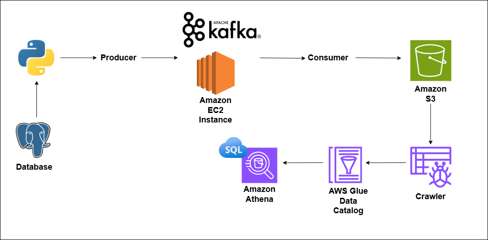

# Kafka Rental Data Pipeline Project

## Architecture Overview


This project aims to create a real-time data pipeline for processing and analyzing Moroccan rental data. It involves extracting data from a postgresql database, streaming it through Apache Kafka, storing it in Amazon S3, and then making it available for SQL-based analysis using Amazon Athena.

### Technology Stack

- **PostgreSQL**: Serves as the primary data source, likely containing the rental data.
- **Python**: Used for creating Kafka producers and consumers, facilitating data extraction from the database and ingestion into the Kafka stream.
- **Apache Kafka**: Enables real-time data processing and streaming, hosted on an **Amazon EC2** instance.
- **Amazon EC2**: Hosts the **Apache Kafka** cluster, providing scalable compute capacity in the cloud.
- **Amazon S3**: Acts as a data lake, storing the processed data from **Kafka** for further analysis.
- **AWS Glue Crawler**: Automatically discovers and catalogs metadata from data stored in **Amazon S3**.
- **AWS Glue Data Catalog**: Stores metadata about the datasets, making them discoverable and queryable.
- **Amazon Athena**: Provides a serverless query service to analyze data directly in **Amazon S3** using standard SQL.
- **SQL**: Used for data analysis on the **Athena** tables, allowing for complex queries on the processed rental data.

This architecture allows for a scalable, serverless approach to process rental data in real-time, from ingestion through to analysis, leveraging various AWS services for data storage, processing, and querying.


# Installation

## Requirements
- Python 3.12 (it may work with earlier versions)
### Install Python using MiniConda

1) Download and install MiniConda from [here](https://docs.anaconda.com/free/miniconda/#quick-command-line-install)
2) Create a new environment using the following command:
```bash
> conda create -n kafka-rental-data-pipeline python = 3.12
```
3) Activate the environment:
```bash
> conda activate kafka-rental-data-pipeline
```

### Install the required packages

```bash
> pip install -r requirements.txt
```

### Setup the environment variables

```bash
> copy .env.example .env
```

Set your environment variables in the `.env` file. Like `AWS_ACCESS_KEY_ID` value.
### Log file

```bash
> copy log.example.txt log.txt
```
<br> 

## Kafka Setup on AWS

This guide provides step-by-step instructions for setting up and running Apache Kafka on an AWS EC2 instance.

### Prerequisites

- An AWS account with EC2 access
- Basic knowledge of AWS services and Linux command line

### EC2 Instance Setup

1. Create an EC2 instance in your desired region.
2. Connect to your EC2 instance:

```
ssh -i "path/to/your/file.pem ... # (Add your specific ssh command here)
```

### Installing Kafka

1. Download and extract Kafka:

```bash
wget https://archive.apache.org/dist/kafka/3.6.1/kafka_2.12-3.6.1.tgz
tar -xvf kafka_2.12-3.6.1.tgz
```

2. Install Java:

```bash
sudo yum install java-17-amazon-corretto
java -version
```

3. Navigate to Kafka directory:

```bash
cd kafka_2.12-3.6.1
```

### Starting Zookeeper and Kafka

1. Start Zookeeper:

```bash
bin/zookeeper-server-start.sh config/zookeeper.properties
```

2. In a new terminal session, start the Kafka server:

```bash
export KAFKA_HEAP_OPTS="-Xmx256M -Xms128M"
cd kafka_2.12-3.6.1
bin/kafka-server-start.sh config/server.properties
```

**Note:** You may need to modify `server.properties` to use the public IP of your EC2 instance. Edit the file:

```bash
sudo nano config/server.properties
```

Change `ADVERTISED_LISTENERS` to the public IP of your EC2 instance.

### Creating a Topic

In a new terminal session:

```bash
cd kafka_2.12-3.6.1
bin/kafka-topics.sh --create --topic rental_data_topic --bootstrap-server <YOUR_PUBLIC_IP>:9092 --replication-factor 1 --partitions 1
```

Replace `<YOUR_PUBLIC_IP>` with your EC2 instance's public IP.

### Starting Producer and Consumer

1. Start a producer:

```bash
bin/kafka-console-producer.sh --topic rental_data_topic --bootstrap-server <YOUR_PUBLIC_IP>:9092
```

2. In a new terminal session, start a consumer:

```bash
cd kafka_2.12-3.6.1
bin/kafka-console-consumer.sh --topic rental_data_topic --bootstrap-server <YOUR_PUBLIC_IP>:9092
```

### Troubleshooting

If you encounter issues with Zookeeper, you can kill the process:

```bash
ps aux | grep zookeeper
kill <PID>
```

Replace `<PID>` with the actual process ID of Zookeeper.

---

Remember to replace placeholders (like `<YOUR_PUBLIC_IP>`) with your actual values when using these commands.

### S3 bucket Connection Setup

If you don't have permission to write data from your local machine to your S3 bucket, try adding these permissions:


```json
{
    "Version": "2012-10-17",
    "Statement": [
        {
            "Effect": "Allow",
            "Action": [
                "s3:PutObject",
                "s3:PutObjectAcl"
            ],
            "Resource": "arn:aws:s3:::my_bucket_name/*"
        }
    ]
}
```
